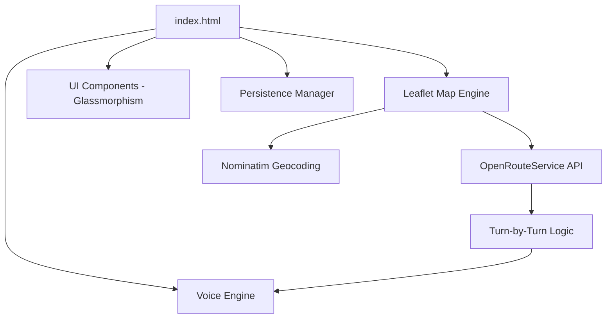

# 🚚 Correo Service - Sistema Inteligente de Logística y Navegación

**Correo Service** es una solución avanzada de logística diseñada específicamente para optimizadores de rutas y personal de entregas. Esta aplicación web progresiva (PWA) combina la potencia de algoritmos de optimización de rutas con un sistema de navegación GPS guiado por voz, todo dentro de una interfaz premium, fluida y orientada a dispositivos móviles.

---

## ✨ Características Principales

### 🗺️ Optimización de Rutas Inteligente

Utiliza el motor de **OpenRouteService** para calcular las trayectorias más eficientes entre múltiples puntos, teniendo en cuenta la red vial real y no solo distancias lineales (línea recta).

- **Soporte TSP (Traveling Salesman Problem):** Ordena tus entregas para minimizar el tiempo y la distancia.
- **Regreso a Base:** Opción configurable para finalizar el recorrido en el punto de partida original.

### 🎙️ Navegación GPS con Voz (Turn-by-Turn)

Sistema de navegación interno que elimina la necesidad de saltar entre aplicaciones de mapas externas.

- **Instrucciones en Tiempo Real:** Guía visual y auditiva para cada giro.
- **Detección de Llegada:** Reconocimiento automático de proximidad al destino (30m).
- **Control de Voz:** Ajuste de volumen y activación/desactivación rápida de síntesis de voz.

### 🔒 Acceso y Seguridad Profesional

Interfaz de acceso personalizada con branding corporativo (**Guarnieri Network**).

- **Login Seguro:** Protección de la interfaz principal mediante credenciales.
- **Gestión de Sesión:** Funcionalidad de cierre de sesión integrada.

### 📱 Experiencia PWA (Progressive Web App)

- **Instalable:** Añade Correo Service a tu pantalla de inicio en Android o iOS como una app nativa.
- **Offline Ready:** Arquitectura optimizada para un rendimiento rápido y fluido.
- **Diseño Glassmorphism:** Interfaz ultra-moderna con efectos de desenfoque, modo oscuro y animaciones suaves.

### 💾 Persistencia de Datos

- **Guardado de Rutas:** Guarda tu planificación localmente para retomarla en cualquier momento sin perder el progreso.
- **Carga Rápida:** Recupera estados de ruta completos con un solo toque.

---

## 🛠️ Stack Tecnológico

El proyecto está construido bajo una filosofía de alto rendimiento sin dependencias pesadas:

- **Core:** HTML5 Semántico, CSS3 con Variables y Flexbox/Grid.
- **Motor de Mapas:** [Leaflet.js](https://leafletjs.com/) (Ligero y potente).
- **Servicio de Rutas:** [OpenRouteService API](https://openrouteservice.org/) (Precisión vial).
- **Geocodificación:** [Nominatim (OpenStreetMap)](https://nominatim.org/).
- **Voz:** [Web Speech API](https://developer.mozilla.org/en-US/docs/Web/API/Web_Speech_API).
- **Ubicación:** [Geolocation API](https://developer.mozilla.org/en-US/docs/Web/API/Geolocation_API).
- **Estilo de Mapa:** CartoDB Dark Matter (Optimizado para legibilidad y ahorro de batería).

---

## 🚀 Instalación y Despliegue

### Requisitos Previos

1. Una clave de API gratuita de [OpenRouteService](https://openrouteservice.org/dev/#/signup).

### Configuración

1. Abre el archivo `index.html`.
2. Busca la constante `ORS_API_KEY` (alrededor de la línea 497).
3. Reemplaza el valor con tu propia clave.

### Despliegue Directo

Debido a que es una aplicación estática, puedes desplegarla en segundos:

- **Netlify/Vercel:** Simplemente arrastra la carpeta `web-app` al panel de control.
- **GitHub Pages:** Sube los archivos a un repositorio y activa las Pages.
- **Servidor Local:** Abre `index.html` en cualquier navegador moderno.

---

## 📖 Guía de Uso

1. **Inicio de Sesión:** Ingresa tus credenciales en la pantalla de bienvenida.
2. **Establecer Base:** Escribe la dirección de salida en "Punto de Partida" y presiona `+`.
3. **Agregar Destinos:** Añade todas las entregas pendientes en la lista de destinos.
4. **Optimizar:** Presiona el botón flotante "Optimizar Ruta" para trazar el camino más corto por las calles.
5. **Navegar:** Presiona "Iniciar GPS" para activar el modo de conducción. Sigue las instrucciones de voz hasta completar tus entregas.
6. **Guardar:** Si necesitas pausar, usa "Guardar Ruta" para no perder los datos.

---

## 📐 Arquitectura del Proyecto

---

## 🛡️ Créditos y Licencia

Desarrollado con ❤️ por **GUARNIERI NETWORK**.

Este software se proporciona tal cual, diseñado para la eficiencia en operaciones logísticas. El uso de APIs externas está sujeto a los términos y condiciones de sus respectivos proveedores (OpenRouteService, OpenStreetMap).

---

> **Nota:** Para un rendimiento óptimo en dispositivos móviles, se recomienda utilizar Google Chrome o Safari y añadir la aplicación a la pantalla de inicio.
