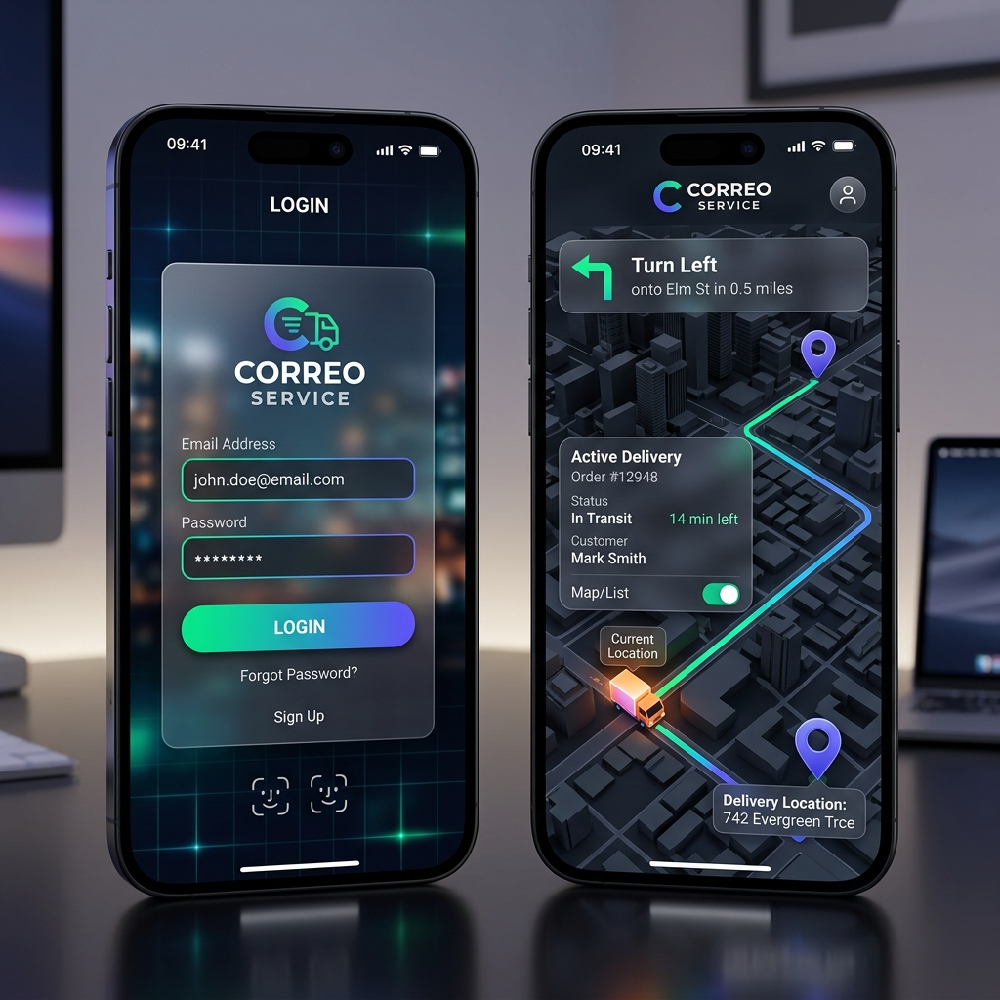
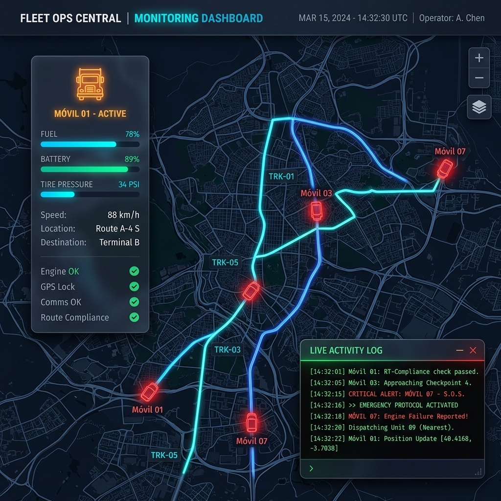
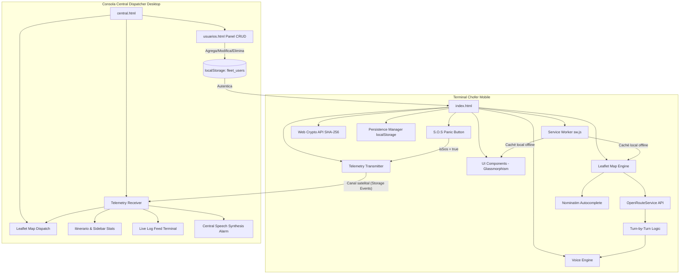

# 🚚 Correo Service - Sistema Inteligente de Logística y Navegación

  
  

 

**Correo Service** es una solución avanzada de logística diseñada específicamente para optimizadores de rutas y personal de entregas. Esta aplicación web progresiva (PWA) de nivel empresarial combina la potencia de algoritmos de optimización de rutas con un sistema de navegación GPS guiado por voz, todo dentro de una interfaz de diseño premium, fluida, offline-first y optimizada para dispositivos móviles.

Adicionalmente, cuenta con un portal centralizado de despacho que permite a la oficina monitorizar el trayecto del vehículo, el estado de sus entregas y eventos en tiempo real.

---

## ✨ Características Principales

### 🗺️ Optimización de Rutas Inteligente con Autocompletado
* **Búsqueda Inteligente OSM:** Cuenta con un panel de sugerencias y autocompletado en tiempo real (asincrónico y con *debounce*) que busca direcciones exactas a través del servicio de Nominatim (OpenStreetMap).
* **Soporte TSP (Traveling Salesman Problem):** Calcula las trayectorias más eficientes entre múltiples paradas utilizando la red vial real del motor **OpenRouteService**, minimizando distancias y tiempos de entrega.
* **Regreso a Base:** Opción para que el recorrido finalice exactamente en el depósito central o punto de partida original.

### 🎙️ Navegación GPS con Voz (Turn-by-Turn)
* **Guiado Interno en Vivo:** Elimina la necesidad de saltar entre aplicaciones de mapas externas.
* **Instrucciones en Tiempo Real:** Guía auditiva y visual de alta precisión para cada giro.
* **Detección Automática de Llegada:** Reconocimiento inteligente de proximidad (radio de 30m) para avanzar al siguiente destino de forma automática.
* **Control de Voz Integrado:** Modulación de volumen y silenciado rápido nativo.

### 🛰️ Central de Monitoreo & Telemetría en Vivo (Control de Flotas)
* **Enlace Satelital Local:** La app implementa un canal de comunicación en tiempo real (`fleet_telemetry_admin`) que conecta la pantalla del conductor con el portal central.
* **Portal Dispatch Central (`central.html`):** Una consola premium de pantalla completa para despachadores y oficinas que permite vigilar la ubicación GPS de los camiones, ver itinerarios y recibir alertas en vivo de forma instantánea.
* **Registro de Telemetría Dinámico:** Consola de comandos monoespaciada en la central que transcribe logs de actividad automáticamente (*"Móvil 01 inició GPS"*, *"Móvil 01 completó la Parada 1"*, etc.).
* **Panel de Estadísticas "Resumen de Jornada":** Al completar la última entrega, la app del conductor despliega un informe corporativo translúcido con efectividad del 100%, paradas completadas, fecha y firma de **GUARNIERI NETWORK**.

### 🚨 Sistema de Alerta S.O.S Satelital en Tiempo Real (Filtro Anti-Error)
* **Botón de Pánico Dual:** Accesible tanto en la pantalla del conductor principal como en la barra activa de navegación por voz del GPS (ocupando el 25% de la interfaz para máxima ergonomía).
* **Confirmación por Filtro Anti-Error:** Al presionarse, se despliega una modal premium de Glassmorphism solicitando confirmación crítica para evitar falsas alarmas satelitales en la oficina debido a golpes o baches.
* **Alertas por Voz de Oficina y Chofer:** Al activarse, la app del chofer habla indicando el inicio del S.O.S, mientras que la consola de la Central grita por voz nativa: *"¡Atención! El vehículo Móvil 01 ha activado una señal de emergencia S.O.S. Verifique su ubicación en el mapa de inmediato."*
* **Comportamiento Táctico en Central:** El marcador del camión en la oficina se tiñe de color rojo carmesí y emite anillos de radar expansivos parpadeantes, la tarjeta lateral parpadea en color carmín con el estado `🚨 EMERGENCIA S.O.S` y los logs en vivo imprimen alertas críticas con prioridad máxima en rojo neón.

### 🔒 Acceso y Seguridad de Nivel Industrial
* **Doble Portal de Acceso Secure (Chofer / Admin):**
  - Acceso Chofer directo con usuario/clave.
  - Puerta de enlace secundaria cian hacia la Consola de Monitoreo de Oficina que solicita la clave de administrador mediante una interfaz modal translúcida enfocada.
* **Cifrado SHA-256 Nativo:** Protege ambas pantallas de acceso usando la **Web Crypto API** del navegador. Las credenciales nunca se guardan en texto plano; la validación compara firmas *hash* SHA-256 de una sola vía (ej. el HASH `03ac674216f3...` para la contraseña admin `1234`), garantizando seguridad blindada y firmada por **GUARNIERI NETWORK**.
* **Experiencia de Formulario Fluida:** Soporte semántico para envío por tecla **Enter**, botones homogeneizados de cierre de sesión (**Salir**) de estilo rojo translúcido, y animación física de sacudida (shake) al ingresar datos incorrectos.

### 👥 Panel de Gestión de Usuarios CRUD (Administración Dinámica)
* **CRUD Completo de Conductores:** Permite al administrador crear (generar), modificar y eliminar cuentas de conductores y despachadores directamente desde la aplicación sin requerir bases de datos del servidor.
* **Almacenamiento Local Persistente (`localStorage`):** Los usuarios se guardan en la clave `'fleet_users'`. La aplicación se precarga automáticamente con credenciales por defecto (`admin`, `conductor1`, `conductor2`) si no existen registros.
* **Integración Satelital Dinámica:** Al iniciar sesión con una cuenta de conductor personalizada, el sistema de telemetría asocia el viaje a su nombre real, mostrándolo en los paneles de la Central de Monitoreo (`central.html`) en lugar del valor genérico "Admin".
* **Visualización de Contraseñas Ocultas (Efecto Blur):** Un efecto visual premium en la lista de usuarios desenfoca las contraseñas (`filter: blur(4px)`) y las revela instantáneamente al pasar el cursor encima, manteniendo la confidencialidad.
* **Control de Seguridad y Protección:** Incluye bloqueos lógicos para impedir que se elimine la cuenta del administrador principal (`admin`) y cuenta con un cuadro modal de confirmación de borrado *glassmorphism* de estilo premium.
* **Navegación e Indicaciones por Voz:** Integra locuciones asincrónicas por voz para indicar operaciones completadas en el panel ("Usuario creado", "Usuario modificado", "Usuario eliminado").

### 📱 Experiencia PWA & Modo Sin Conexión (Offline-First)
* **Service Worker (`sw.js`):** La aplicación se instala y ejecuta en segundo plano. Permite cargar el sitio al 100% de manera instantánea incluso en "Modo Avión" o sin cobertura telefónica.
* **Caché Inteligente de Mapas (On-the-Fly Tile Caching):** El Service Worker intercepta y almacena localmente los segmentos de mapa oscuro que el chofer carga durante su estancia en la base. Las calles se ven perfectamente sin internet.
* **Badges Pulsantes de Conexión:** Indicadores LED en tiempo real con "latido neón" verde (**En Línea**) o naranja (**Sin Conexión**) en la cabecera y el login.
* **Persistencia Local (`localStorage`):** Posibilidad de **Guardar Ruta** preventivamente en la base para luego **Cargar Ruta** en zonas sin cobertura, permitiendo navegar de forma satelital con guiado de voz y GPS nativos (que no requieren internet).

### 🎨 Diseño de Interfaz Premium (Mockup Fidelity)
* **Identidad Vectorial SVG:** Integración del logotipo corporativo oficial diseñado en vectores SVG fluidos con ventana translúcida y resplandor neón en el login y panel de control.
* **Marcadores Premium Animados:**
  - **Base/Warehouse:** Un pin verde esmeralda con icono de depósito y anillo pulsante (`marker-pulse`) de ubicación.
  - **Destinos Numerados:** Pines degradados púrpura que muestran **números secuenciales de entrega (1, 2, 3...)** que se re-indexan solos en el mapa si quitas paradas.
* **GPS Radar Pulsante:** Un cursor de chofer vivo con un haz de radar expansivo dinámico (`user-location-marker`).
* **Ruta de Brillo Neón:** Trazado de carreteras con doble capa, proyectando un resplandor de fondo cian eléctrico (`#06b6d4`).

---

## 🛠️ Stack Tecnológico

El proyecto está construido bajo una filosofía de alto rendimiento sin dependencias pesadas:

- **Core:** HTML5 Semántico, CSS3 con Variables y Flexbox/Grid (Glassmorphism).
- **Motor de Mapas:** [Leaflet.js](https://leafletjs.com/) (Versión 1.9.4 nativa en caché).
- **Servidor de Rutas:** [OpenRouteService API](https://openrouteservice.org/) (Ruteo real).
- **Geocodificación:** [Nominatim (OpenStreetMap)](https://nominatim.org/).
- **Criptografía:** [Web Crypto API](https://developer.mozilla.org/en-US/docs/Web/API/Web_Crypto_API) (Algoritmo SHA-256 asincrónico).
- **Service Worker:** API nativa de PWAs para caché de tiles y recursos offline.
- **Motor de Voz:** [Web Speech API](https://developer.mozilla.org/en-US/docs/Web/API/Web_Speech_API).
- **Estilo de Mapa:** CartoDB Dark Matter (Optimizado para legibilidad y ahorro de batería).

---

## 🚀 Instalación y Despliegue

### Requisitos Previos

1. Una clave de API gratuita de [OpenRouteService](https://openrouteservice.org/dev/#/signup).

### Configuración

1. Abre el archivo `index.html`.
2. Busca la constante `ORS_API_KEY` (alrededor de la línea 600).
3. Reemplaza el valor con tu propia clave.

### Despliegue Directo

Debido a que es una aplicación estática autoprotegida y PWA:

- **Netlify/Vercel:** Simplemente arrastra la carpeta `web-app` al panel de control.
- **GitHub Pages:** Sube los archivos a un repositorio y activa las Pages.
- **Servidor Local:** Abre `index.html` en cualquier navegador moderno.

---

## 📖 Guía de Uso

1. **Inicio de Sesión:** Ingresa tus credenciales en la pantalla de bienvenida (usuario `admin` / clave `1234`). Puedes presionar la tecla **Enter** para entrar o utilizar cualquiera de las cuentas de conductor registradas.
2. **Establecer Base:** Escribe la dirección en "Punto de Partida" y selecciona una sugerencia del panel de autocompletado.
3. **Agregar Destinos:** Añade todas las entregas usando las sugerencias inteligentes de dirección y presiona `+`.
4. **Guardar Ruta:** Si planeas salir a una zona de mala señal, haz click en **Guardar Ruta** para persistir el viaje localmente.
5. **Optimizar:** Presiona el botón flotante "Optimizar Ruta" para trazar el camino más corto y glowing neón por las calles.
6. **Navegar:** Presiona "Iniciar GPS" para activar el modo de conducción. Sigue las instrucciones de voz hasta completar tus entregas.
7. **Monitorear (Central):** Abre `central.html` en una pestaña secundaria o en una pantalla dividida para ver al chofer moverse y completar las paradas en vivo.
8. **Gestión de Usuarios (Admin):** Haz clic en el botón **Usuarios** en la cabecera de la Central para ingresar a `usuarios.html`. Desde allí podrás añadir nuevos choferes con contraseñas personalizadas, editarlos o darlos de baja.

---

## 📐 Arquitectura del Proyecto y Telemetría

La aplicación separa la consola del transportista móvil de la terminal de despacho central en la oficina, enlazándolos en tiempo real de forma directa:

---

## 🛡️ Créditos y Licencia

Desarrollado con ❤️ por **GUARNIERI NETWORK**.

Este software se proporciona tal cual, diseñado para la eficiencia en operaciones logísticas. El uso de APIs externas está sujeto a los términos y condiciones de sus respectivos proveedores (OpenRouteService, OpenStreetMap).

---

> **Note:** Para un rendimiento óptimo en dispositivos móviles, se recomienda utilizar Google Chrome o Safari y añadir la aplicación a la pantalla de inicio para disfrutar de la experiencia a pantalla completa como App Nativa.
